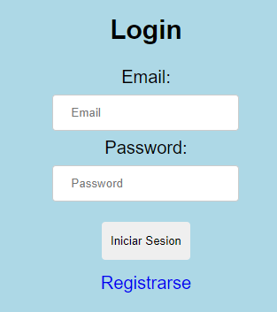

# Admin Tasks

### Application with login and crud task

This is a project for a practice of node and react js.

## Area
- [x] Frontend
- [x] Backend: https://github.com/jonatan-c/crud-login-mern-servidor

## Deploy
- [x] Local.
- [x] Heroku(Frontend):https://crud-mern-login.netlify.app/
- [ ] AWS.
- [x] Netlify(Backend).
- [ ] None.


## <a name="table-of-contents"></a>Table of Contents
- [Instalation](#installation)
- [Documentation](#documentation)
- [Images](#images)
- [Technologies](#technologies)

## <a name="installation"></a>Instalation:

- Clone the repository or download
- Open whith editor
- Open Terminal
- Install dependencies:
```
npm install
```


- Run the project

`npm start`


## <a name="images"></a>Images:



## <a name="technologies"></a>Technologies:
- React
- Axios
- HTML
- CSS

## Project management software
- [ ] Trello: 
- [ ] Jira: 
- [x] None

## Agile methodology
- [ ] Scrum
- [ ] Kanban
- [x] Not applied

## CI/CD
- [ ] Applied
- [x] Not applied

## AWS(services)
- [ ] Applied
- [x] Not applied
